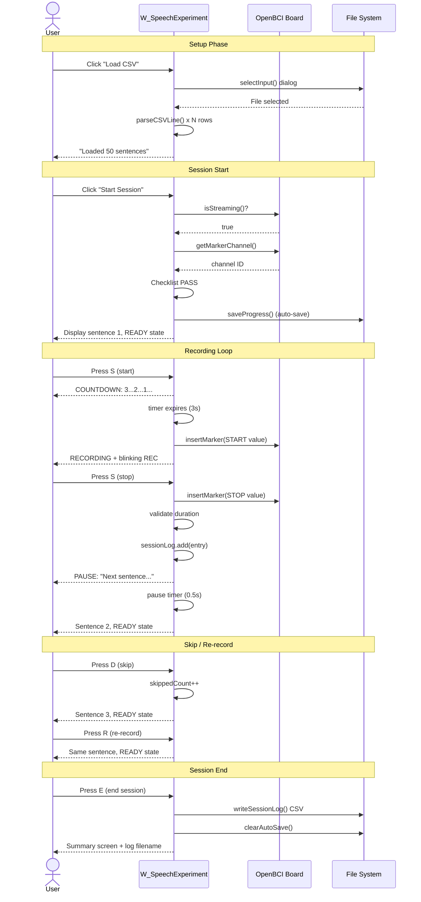
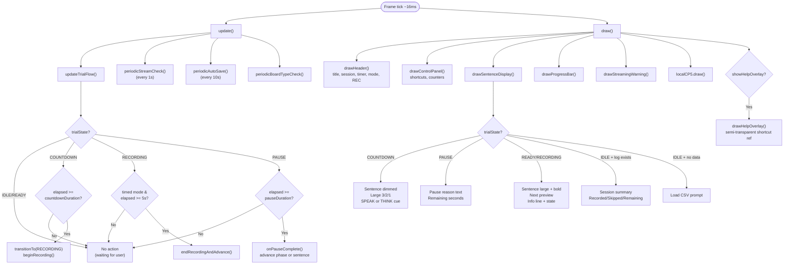

# W_SpeechExperiment — Application Flow Diagrams

## 1. Trial State Machine

```mermaid
stateDiagram-v2
    [*] --> IDLE

    IDLE --> READY : startSession()\n[checklist passes]
    
    READY --> COUNTDOWN : S key\n[countdown > 0]
    READY --> RECORDING : S key\n[countdown = 0]
    
    COUNTDOWN --> READY : S key\n(cancel)
    COUNTDOWN --> RECORDING : timer expires\n(3s or 5s)
    
    RECORDING --> PAUSE : S key / auto-stop\nendRecordingAndAdvance()
    
    PAUSE --> COUNTDOWN : parallel phase 0 done\nswitch to phase 1\n[countdown > 0]
    PAUSE --> RECORDING : parallel phase 0 done\n[countdown = 0]
    PAUSE --> READY : sentence done\n[manual mode]
    PAUSE --> COUNTDOWN : sentence done\n[continuous mode]
    PAUSE --> IDLE : last sentence done\nendSession()
    
    READY --> IDLE : P key / pauseSession()
    RECORDING --> IDLE : P key / pauseSession()
    COUNTDOWN --> IDLE : P key / pauseSession()
    
    READY --> IDLE : E key / endSession()
    
    RECORDING --> READY : R key / reRecord()
    READY --> READY : R key (no-op,\nstay on same sentence)

    note right of IDLE : No session active.\nLoad CSV, configure dropdowns.
    note right of READY : Sentence displayed.\nAwaiting S key.
    note right of COUNTDOWN : "Large 3..2..1 overlay.\nCue: SPEAK or THINK"
    note right of RECORDING : Markers inserted.\nBlinking REC dot + timer.
    note right of PAUSE : Brief delay.\nShows reason text.
```

## 2. Complete Session Lifecycle

```mermaid
flowchart TD
    START(["App Start"]) --> CONSTRUCT["Constructor\nCreate buttons, dropdowns\nInit sentences=[], sessionLog=[]"]
    CONSTRUCT --> MAINLOOP["Main Loop (60fps)\nupdate() + draw()"]
    
    MAINLOOP --> LOADCSV["User clicks Load CSV"]
    LOADCSV --> DIALOG["File selection dialog"]
    DIALOG --> PARSE["parseCSVLine()\nBOM strip, header validation\nRFC 4180 parsing"]
    PARSE --> LOADED["sentences loaded\ntotalSentences set\nState: IDLE"]
    
    LOADED --> STARTSESS["User clicks Start Session"]
    STARTSESS --> CHECKLIST{"Pre-session\nchecklist"}
    CHECKLIST -->|"FAIL:\nno sentences,\nnot streaming,\nno marker ch"| ERROR["outputError()\nStay in IDLE"]
    ERROR --> STARTSESS
    
    CHECKLIST -->|PASS| ACTIVE["sessionActive = true\ncounters reset\nsessionLog cleared\nauto-save written\nState: READY"]
    
    ACTIVE --> SENTLOOP["Per-sentence loop"]
    
    subgraph SENTLOOP["Sentence Recording Loop"]
        direction TB
        DISPLAY["Display sentence\n+ next preview\n+ info line"]
        RECORD["User presses S\nor auto-start (continuous)"]
        CDOWN["COUNTDOWN\n3..2..1"]
        REC["RECORDING\nmarker START inserted\ntimer shown"]
        STOP["User presses S\nor auto-stop (timed)"]
        STOPREC["endRecording()\nmarker STOP inserted\nduration validated\nlog entry created"]
        
        DISPLAY --> RECORD
        RECORD --> CDOWN
        CDOWN --> REC
        REC --> STOP
        STOP --> STOPREC
    end

    STOPREC --> PARALLEL{"Parallel mode\n& phase 0?"}
    PARALLEL -->|Yes| MODEPAUSE["PAUSE 1.5s\nSwitch speaking mode\nGo to phase 1"]
    MODEPAUSE --> DISPLAY
    
    PARALLEL -->|No| SENTPAUSE["PAUSE 0.5s\nAdvance sentence"]
    SENTPAUSE --> MORE{"More\nsentences?"}
    MORE -->|Yes| DISPLAY
    MORE -->|No| ENDSESS
    
    subgraph ENDSESS["End Session"]
        direction TB
        WRITELOG["writeSessionLog()\nCSV to Recordings/"]
        CLEARAUTO["clearAutoSave()\ndelete temp JSON"]
        SUMMARY["Show summary screen\nRecorded / Skipped / Remaining\nLog filename"]
        WRITELOG --> CLEARAUTO --> SUMMARY
    end
    
    SUMMARY --> IDLE2["State: IDLE\nReady for next session"]
```



## 3. Parallel Recording Flow (per sentence)

```mermaid
flowchart TD
    SENTENCE["Sentence N displayed"]

    subgraph PHASE0["Phase 0: First Mode"]
        direction TB
        P0MODE["Set speakingMode\nbased on trial order"]
        P0READY["READY\nPress S to start"]
        P0COUNT["COUNTDOWN 3s\nGet ready to SPEAK/THINK"]
        P0REC["RECORDING\nSTART marker inserted"]
        P0STOP["User stops\nSTOP marker inserted\nLog entry added"]
        
        P0MODE --> P0READY --> P0COUNT --> P0REC --> P0STOP
    end

    subgraph SWITCH["Mode Switch Pause"]
        PAUSE1["PAUSE 1.5s\nSwitching to Silent/Vocalized..."]
        FLIP["parallelPhase = 1\nspeakingMode flipped"]
        PAUSE1 --> FLIP
    end

    subgraph PHASE1["Phase 1: Second Mode"]
        direction TB
        P1COUNT["COUNTDOWN 3s\nGet ready to THINK/SPEAK"]
        P1REC["RECORDING\nSTART marker inserted\n(different mode encoding)"]
        P1STOP["User stops\nSTOP marker inserted\nLog entry added"]
        
        P1COUNT --> P1REC --> P1STOP
    end

    subgraph ADVANCE["Advance"]
        PAUSE2["PAUSE 0.5s\nNext sentence..."]
        NEXT["parallelPhase = 0\ncurrentSentenceIndex++"]
        PAUSE2 --> NEXT
    end

    SENTENCE --> PHASE0
    PHASE0 --> SWITCH
    SWITCH --> PHASE1
    PHASE1 --> ADVANCE
    ADVANCE --> NEXTSENT["Sentence N+1\nor endSession()"]

    style PHASE0 fill:#2a4a2a,stroke:#4a8a4a
    style PHASE1 fill:#2a2a4a,stroke:#4a4a8a
    style SWITCH fill:#4a3a2a,stroke:#8a6a3a
```



## 4. User Interaction Sequence



## 5. Processing Main Loop (per frame)



## 6. Error Handling & Recovery

```mermaid
flowchart TD
    subgraph RUNTIME["Runtime Error Handling"]
        MF["Marker insertion fails\n(not streaming / no channel)"]
        MF --> MFA["insertSpeechMarker()\nreturns false"]
        MFA --> MFB["Log appends\n[MARKER FAILED]"]
        MFB --> MFC["Recording continues\n(data still collected)"]

        DV["Duration out of range"]
        DV --> DVA{"< 1 second?"}
        DVA -->|Yes| DVB["outputWarn: too short\nSuggest re-record"]
        DVA -->|No| DVC{"> 30 seconds?"}
        DVC -->|Yes| DVD["outputWarn: too long\nCheck if left running"]
        DVC -->|No| DVE["Duration OK"]

        SL["Streaming lost mid-session"]
        SL --> SLA["periodicStreamCheck()\ndetects !isStreaming"]
        SLA --> SLB["Yellow warning banner\npersists on screen"]
        SLB --> SLC["Markers silently fail\nuntil streaming resumes"]
    end

    subgraph CRASH["Crash Recovery"]
        CR1["App crashes during session"]
        CR1 --> CR2["Auto-save JSON exists\n(saved every 10s)"]
        CR2 --> CR3["Next app launch"]
        CR3 --> CR4["hasAutoSave() = true"]
        CR4 --> CR5["loadAutoSave()"]
        CR5 --> CR6["Reload CSV from saved path"]
        CR6 --> CR7["Restore:\n- sentenceIndex\n- sessionId\n- counters\n- mode settings"]
        CR7 --> CR8["User clicks Start Session\nresumes from saved position"]
        CR8 --> CR9["Auto-save file deleted\nafter successful restore"]
    end

    subgraph CHECKLIST["Pre-session Checklist"]
        CK1["startSession() called"]
        CK1 --> CK2{"sentences\nloaded?"}
        CK2 -->|No| CKF1["FAIL: No sentences"]
        CK2 -->|Yes| CK3{"board\nstreaming?"}
        CK3 -->|No| CKF2["FAIL: Not streaming"]
        CK3 -->|Yes| CK4{"marker\nchannel?"}
        CK4 -->|No| CKF3["FAIL: No marker ch"]
        CK4 -->|Yes| CK5{"synthetic /\nplayback?"}
        CK5 -->|Yes| CKW["WARN: markers may not persist\n(does not block)"]
        CK5 -->|No| CKPASS["Checklist PASS"]
        CKW --> CKPASS
    end

    style CRASH fill:#2a2a3a,stroke:#5a5a8a
    style CHECKLIST fill:#2a3a2a,stroke:#5a8a5a
```



## 7. Widget UI Layout

```mermaid
block-beta
    columns 1
    
    block:NAV["Nav Bar (navH*2 = 44px)"]
        columns 4
        WS["Widget Selector"]
        DD1["Rec Mode"]
        DD2["Trial Mode"]
        DD3["Countdown"]
    end
    
    block:HEADER["Header Bar (40px)"]
        columns 3
        TITLE["Speech Exp - file.csv | Sess:1 | 3:42"]
        space
        MODEINDICATOR["VOCALIZED  REC 0:05"]
    end
    
    block:CONTROLS["Control Panel (80px)"]
        columns 1
        block:ROW1
            columns 5
            B1["Load CSV"]
            B2["Start Session"]
            B3["Pause"]
            B4["End Session"]
            B5["Practice: OFF"]
        end
        block:ROW2
            columns 3
            B6["Start Recording"]
            B7["Next -->"]
            B8["Re-record"]
        end
        HELPLINE["S=Record D=Next P=Pause R=Re-record M=Mode ... | Rec:5 Skip:1 Left:4"]
    end
    
    block:DISPLAY["Sentence Display (fills remaining space)"]
        columns 1
        STATE_IND["Press S to start recording"]
        space
        SENTENCE["The quick brown fox jumps\nover the lazy dog."]
        space
        PREVIEW["Next: She sells seashells by the seashore..."]
        INFOLINE["ID: S001 | Mode: Vocalized | Phase: 1/2 | Font: 28"]
    end
    
    block:PROGRESS["Progress Bar (30px)"]
        columns 1
        PROGBAR["||||||||||||         5/10 (50.0%) Vocalized 1/2"]
    end

    style HEADER fill:#323237
    style CONTROLS fill:#2d2d32
    style DISPLAY fill:#1e1e23
    style PROGRESS fill:#3c3c3c
```



## 8. Keyboard Shortcut Map

```mermaid
flowchart LR
    subgraph ALWAYS["Always Active"]
        H["H: Toggle help overlay"]
        PLUS["+: Increase font size"]
        MINUS["-: Decrease font size"]
    end

    subgraph SESSION["Session Active Only"]
        S["S: Start/Stop recording\nor Cancel countdown"]
        D["D: Skip to next sentence"]
        P["P: Pause session"]
        R["R: Re-record current"]
        E["E: End session + save log"]
        M["M: Toggle Silent/Vocalized\n(single trial mode only)"]
    end

    S --> |STATE_READY| COUNTDOWN2["Start countdown"]
    S --> |STATE_COUNTDOWN| CANCEL["Cancel, back to READY"]
    S --> |STATE_RECORDING| STOP2["Stop + advance"]
    S --> |STATE_PAUSE| SKIPPER["Skip pause"]

    style ALWAYS fill:#2a3a2a,stroke:#5a8a5a
    style SESSION fill:#2a2a3a,stroke:#5a5a8a
```


