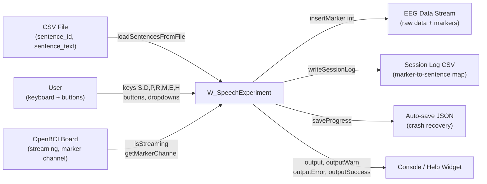
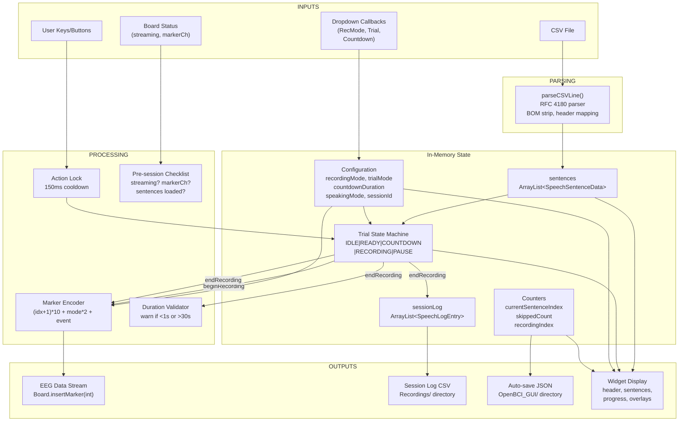
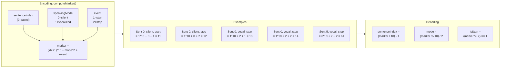
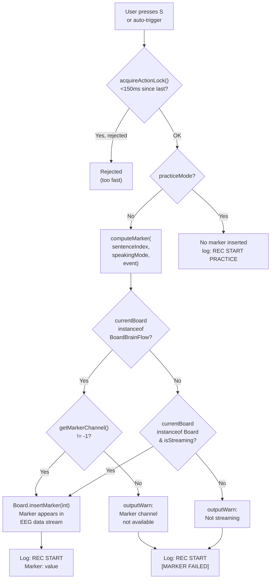
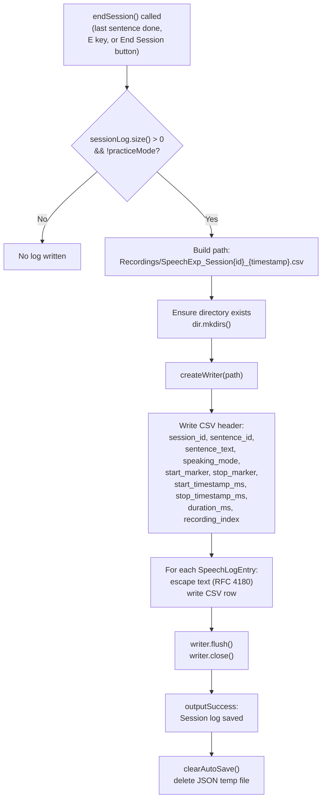
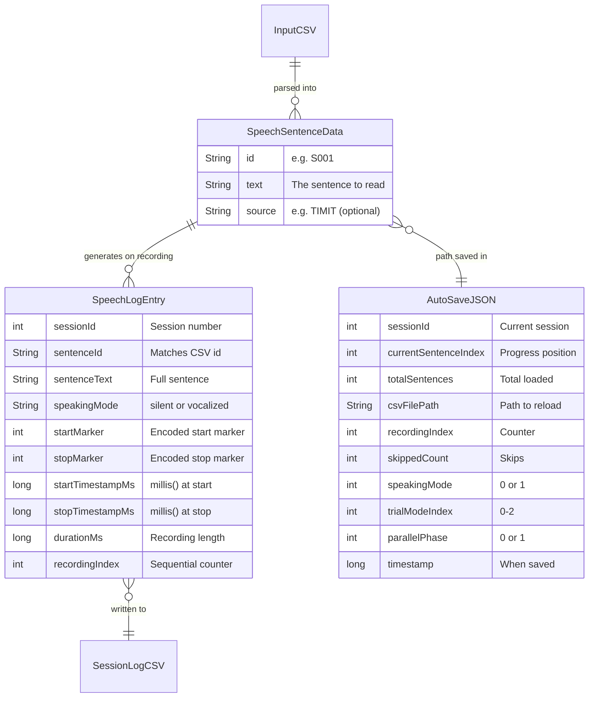
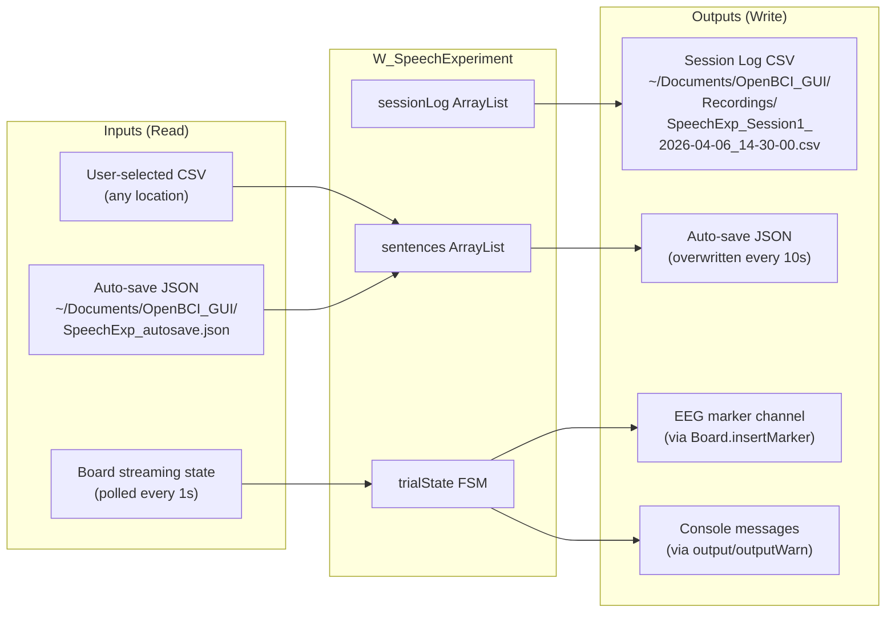

# W_SpeechExperiment — Data Flow Diagrams

## 1. Context Diagram (Level 0)

## 2. Internal Data Flow (Level 1)

## 3. Marker Encoding & Decoding

## 4. Marker Insertion Path

## 5. Session Log Output Path

## 6. Data Stores Reference

## 7. File I/O Summary

